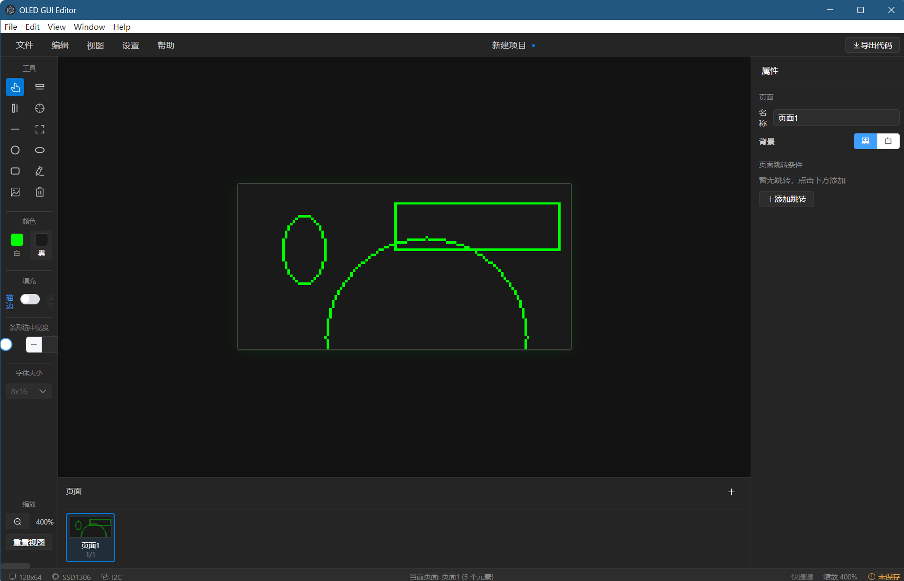
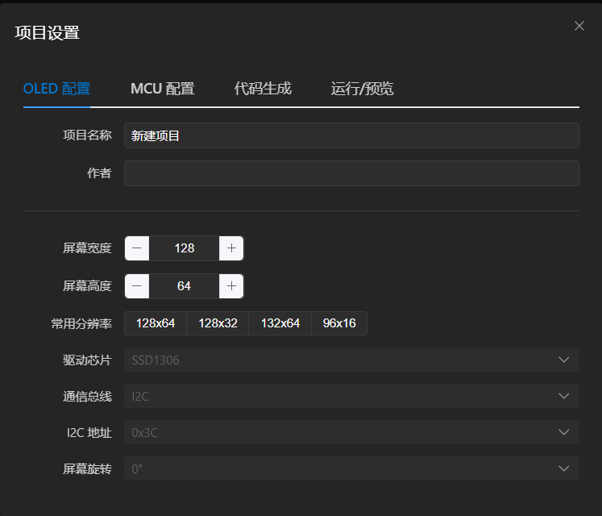

# OLED GUI Editor

[English](README.md) · [中文](README_CN.md)

A cross-platform visual editor for OLED screens. Design your UI graphically and generate ready-to-use STM32 C code.

Built with Electron + Vue 3 + TypeScript.

[](LICENSE)


[](CONTRIBUTING.md)

> Stop hand-coding bitmap arrays. Draw the UI, click *Generate*, get drop-in C files for SSD1306 / SSD1309 / SH1106 over I²C or SPI.

## Screenshots

| Visual Editor | Project Settings |
|:---:|:---:|
|  |  |

## Features

- **Visual Editing** — Draw pixels, lines, rectangles, circles, ellipses, rounded rectangles, polygons, text and images directly on a simulated OLED screen
- **Multi-page Support** — Create multiple pages with navigation links and transitions
- **Code Generation** — Export complete C source files for STM32 (HAL / StdPeriph / bare-metal)
- **Multiple Drivers** — SSD1306, SSD1309, SH1106
- **Multiple Interfaces** — I2C, SPI (3-wire / 4-wire)
- **Image Import** — Import images with binarization and dithering for OLED display
- **Layer Management** — Z-index ordering, visibility toggling, element locking
- **Undo/Redo** — Full history support
- **Keyboard Shortcuts** — Efficient workflow with hotkeys

## Tech Stack

| Tech | Purpose |
|------|---------|
| Vue 3 + TypeScript | Frontend framework |
| Electron | Cross-platform desktop app |
| Vite | Build tool |
| Konva.js | Canvas rendering engine |
| Element Plus | UI components |
| Pinia | State management |

## Getting Started

### Prerequisites

- Node.js >= 18
- npm or yarn

### Install & Run

```bash
# Clone the repository
git clone https://github.com/dignifnrfb/oled-gui-editor.git
cd oled-gui-editor

# Install dependencies
npm install

# Run in development mode (Electron + Vite)
npm run electron:dev

# Or run Vite only (web preview)
npm run dev
```

### Build

```bash
# Build production app
npm run build

# Build Electron installer
npm run electron:build
```

## Supported OLED Configurations

| Driver | Resolution | Interface |
|--------|-----------|-----------|
| SSD1306 | 128x64, 128x32 | I2C, SPI |
| SSD1309 | 128x64 | I2C, SPI |
| SH1106 | 128x64 | I2C, SPI |

## Generated Code Structure

```
output/
├── oled_driver.h/.c    — OLED driver (I2C/SPI init, commands, data transfer)
├── oled_font.h         — Font data (6x8, 8x16, etc.)
├── oled_gui.h/.c       — GUI framework (page manager, transitions, input handling)
├── page_*.h/.c         — Individual page rendering functions
└── oled_images.h       — Image bitmap data (if any)
```

## Roadmap

- [ ] Custom font import (TTF → bitmap font with preview)
- [ ] Animation timeline (frame-based sprite playback)
- [ ] More drivers: ST7565, UC1701x, ST7920
- [ ] Live device preview over USB-CDC
- [ ] PlatformIO / Arduino-IDE export presets
- [ ] CLI mode for headless code regeneration in CI

Suggestions welcome — open a [feature request](.github/ISSUE_TEMPLATE/feature_request.yml).

## Contributing

PRs are welcome. See [`CONTRIBUTING.md`](CONTRIBUTING.md) for the dev environment, code style, and how to add a new driver or interface.

## License

[MIT](LICENSE) © 2026 ZHANG WENCHI (`@dignifnrfb`)

## Acknowledgements

Inspired by and supported by the [Linux.do](https://linux.do/) community.
